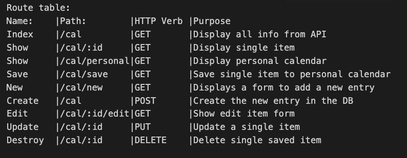

# Hebrew Calendar App
User stories ('As a user...')
- View all calendar items from API - Index
  - import all calendar items to different schemas according to type
  - look for all calendar entries
  - display all calendar entries

- View single calendar item from API - Show
  - look for one calendar item
  - display single item searched for
  - Save single calendar item to personal folder

- Personal calendar - View all items - Saved
  - look for all items in personal folder
  - display all items in personal folder

- Personal calendar - Create new entry - New
  - new schemas (different schemas depending on event type)
  - create the different models to use

- Personal calendar - Edit a single entry - Edit
  - look for a single entry
  - edit that entry
  - get back the updated version

- Personal calendar - Delete single entry - Delete
  - look for a single entry
  - remove entry from db
  - display confirmation

Schemas
- Event entry
  - Category: string
  - title: String / time
  - time: date / time
  - memo: string
  - hebrew: string
  - hebrew date: string
  - yomtov: boolean
  - owner

- Personal Calendar
  - Name: string
  - Description: string
  - Events: Array of strings by 
  - owner

Route table:
Name:    |Path:        |HTTP Verb |Purpose
Index    |/cal         |GET       |Display all info from API
Show     |/cal/:id     |GET       |Display single item
Show     |/cal/personal|GET       |Display personal calendar
Save     |/cal/save    |GET       |Save single item to personal calendar
New      |/cal/new     |GET       |Displays a form to add a new entry
Create   |/cal         |POST      |Create the new entry in the DB
Edit     |/cal/:id/edit|GET       |Show edit item form
Update   |/cal/:id     |PUT       |Update a single item
Destroy  |/cal/:id     |DELETE    |Delete single saved item

